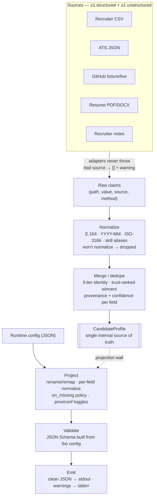

# Multi-Source Candidate Data Transformer — Design (Stage 1)

**Goal.** Turn messy, conflicting, multi-source candidate inputs into **one canonical profile**
per candidate — normalized, deduplicated, with **provenance and confidence on every value**.
Principle: *wrong-but-confident is worse than honestly-empty* — unknowns become `null`, never invented.

## Architecture
`ingest → extract (per-source adapters) → normalize → merge/dedupe → score confidence → canonical record → project (runtime config) → validate → emit`



- **ingest** detects source type by filename; any source may be missing/empty/malformed.
- **extract**: one adapter per source emits raw *claims* `(path, value, source, method)`. Adapters
  **never throw** — a bad source returns `[]` + a warning, so one garbage input can't crash the run.
- **normalize**: pure functions canonicalize each claim; a value that won't normalize is **dropped**.
- **merge**: claims → one `CandidateProfile` (the single internal source of truth).
- **project**: a runtime config reshapes the record; **validate** against a schema built from that config.

## Canonical schema & normalized formats
Fields: `candidate_id, full_name, emails[], phones[], location{city,region,country}, links{linkedin,github,portfolio,other[]}, headline, years_experience, skills[{name,confidence,sources[],verified_in_code}], experience[{company,title,start,end,summary}], education[{institution,degree,field,end_year}], provenance[{field,source,method}], overall_confidence`.
**Phones** → E.164 (`phonenumbers`); **dates** → `YYYY-MM` (a bare year is dropped, never invented as `-01`);
**country** → ISO-3166 alpha-2 (`pycountry`, exact or flagged-fuzzy); **skills** → canonical via an alias
dictionary (`js→JavaScript`), unknowns kept (acronyms preserved); **emails** lowercased/validated.

## Sources (≥1 structured + ≥1 unstructured)
Structured: **Recruiter CSV**, **ATS JSON** (its own field names → an **explicit remap dict**;
unmapped keys are logged, never guessed). Unstructured: **GitHub** (recorded fixture by default,
`--live` for the real API), **Resume PDF/DOCX**, **Recruiter notes**.

## Merge & conflict resolution
- **Identity / `candidate_id` — 3 tiers:** (a) hash of best email; (b) name + matching phone;
  (c) name + source-file identity. **Zero matchable identifiers → no cross-source dedupe** (kept standalone).
- **Scalars:** highest **source trust** wins, tie-broken by completeness then stable order.
  **Lists** (emails, phones, skills…) are unioned & de-duped. Corroboration is **case-insensitive**
  (a different-cased name still corroborates the winner).
- **`verified_in_code` (per skill):** a read-only flag derived from the corroboration already
  computed — `true` iff `github` is among that skill's `sources`. A skill claimed in a resume but
  absent from the candidate's public code carries this flag rather than being silently trusted as
  equally strong. It surfaces an existing signal; it does **not** add a new scoring path or alter
  `confidence`.

## Confidence (concrete math)
`base trust`: ATS 0.90 · CSV 0.85 · Resume 0.60 · GitHub 0.50 · Notes 0.35.
```
per_field = base_trust(winner) + 0.05 * min(corroborations, 3)   # ≤ +0.15
per_field *= 0.9   if value is fuzzy/regex-derived (resume regex, fuzzy country)
per_field  = clamp(per_field, 0.05, 0.99)                        # never 1.0
overall    = importance-weighted mean (identity fields weighted higher)
```
**Worked examples (all reproducible from the shipped samples):**
- **Jane `full_name`:** ATS "Jane Mcdonald" (0.90) corroborated by CSV + GitHub + resume (3 indep.
  agreements, case-insensitive) → +0.15 → 1.05 → clamp **0.99**.
- **Liang `location.country`:** "The Netherlands" → `NL` is fuzzy-matched (value flagged fuzzy). It
  comes from ATS (0.90) corroborated by GitHub (+0.05 = 0.95) → ×0.9 fuzzy = **0.855**.
- **Jane `PostgreSQL` skill:** seen only in the resume, extracted by regex (fuzzy) → 0.60 × 0.9 = **0.54**.
- *(Hypothetical — not in shipped samples)* a skill seen **only** in recruiter notes with no
  corroboration would floor at its base trust = **0.35**.

## Runtime config (projection + validation)
Config selects/renames fields (`from` path DSL: `emails[0]`, `skills[].name`), sets per-field
normalization, toggles provenance/confidence, and chooses a missing-value policy. The policy drives
**three schema shapes**: `omit` → not required · `null` → required + nullable · `error` → required +
non-null (missing fails loudly). The canonical record and the projection are strictly separated, so the
default and any custom shape come from **one engine, no code changes**.

## Edge cases handled
1. Conflicting name casing → trust winner kept, others still corroborate confidence.
2. Malformed phone / bare-year date → dropped, field stays `null`.
3. Malformed JSON / empty CSV → source skipped with a warning; other sources still produce a profile.
4. Same skill, many spellings (JS/JavaScript) → canonicalized & merged, sources combined.
5. No email & no phone match → kept standalone; dedupe deliberately not attempted.

## Scope boundaries (intentional)
Chosen deliberately to keep the system deterministic and explainable: LinkedIn scraping is excluded
(no public API); resume parsing uses deterministic regex/section heuristics rather than ML/NLP, and the
values it produces are flagged low-confidence; cross-candidate identity is limited to the 3-tier chain
(no fuzzy clustering); and the surface is a clean CLI rather than a UI.
